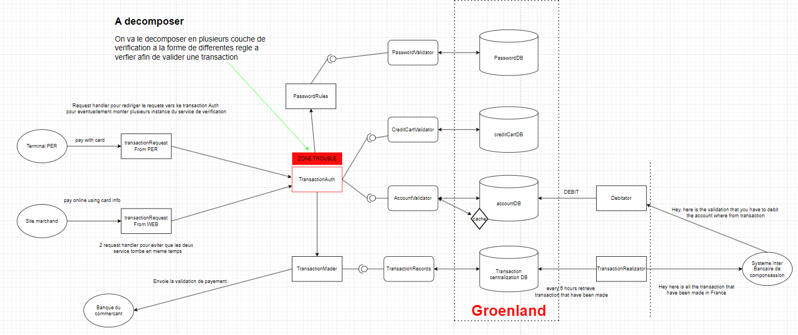
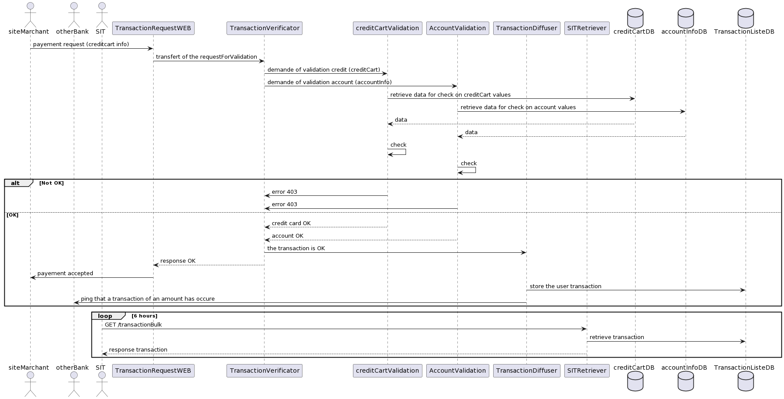

# Architecture Al Project Document

## WEEK 39

### Current Structure of the architechture

In our current architecture, we only support transactions for the moment, but we'd like to concentrate on them so that 
we can consider applications of version 7 of the bank, i.e. large-scale scaling.

In our schema, we have the following external services: the PER terminal, a merchant's site, his bank and the interbank 
clearing system, which manages money exchanges between banks.

We then have a verification layer which retransmits transaction requests to the central transaction verification system.
We've imagined it this way in order to potentially isolate the transaction verification service, which could be the part 
most in demand during a scale-up, so we can raise several instances of this service.

In our verification service, we'd have a set of components that verify each part of the request, which must comply with 
a set of established rules (ceiling limit, sufficient balance, valid credit card, valid transmitted information, correct passwords, etc.). 
Most of the information will be stored in Greenland databases, with which we will interact to retrieve this information. 
A caching solution could also be deployed to speed up retrieval in the event of scaling.

A broadcast component will then be called if the transaction can go through. The money is then frozen on the account,
and the new transaction is added to all those already processed. The customer's bank, if external, is notified of the 
pending transfer.

Every 6 hours (according to the Internet), the SIT will retrieve all the transactions carried out and, once all the transfers 
have been made, will tell the bank to withdraw the frozen money from the accounts. Given that the action of debiting the money 
happens every 6 hours in our conception of the thing, the debiting component may not be asynchronous in the immediate future, 
but in a scaling perspective, it probably will be.

In the end, we'll have 4 layers: transaction reception, verification, communication with external services and databases.

Ideally, what would be most feasible would be to group external management into a single service, which would also include 
functionality not required for transactions, and to output transaction verification processing in a single service.

### Sequence Diagram Flow

